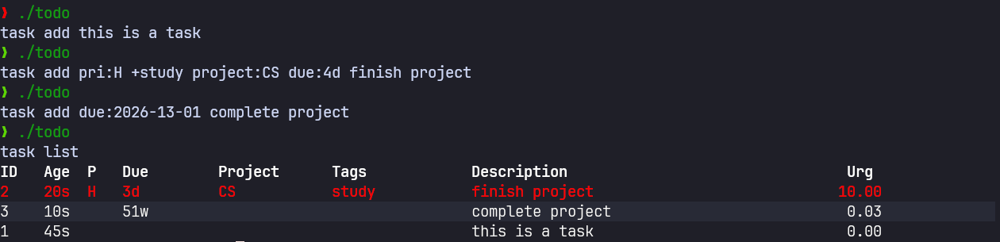
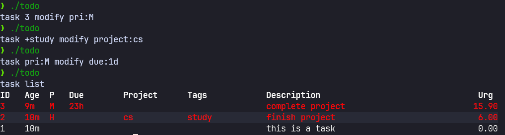
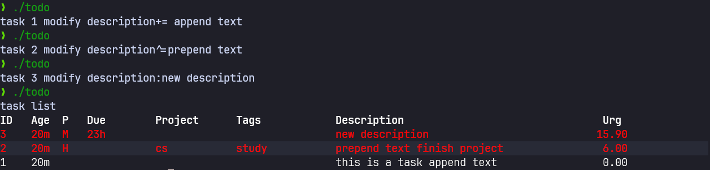
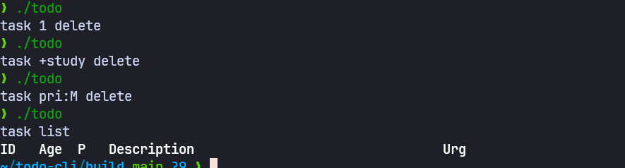

A todo CLI written in C++, inspired by Taskwarrior.

Supports adding, listing, modifying, and deleting tasks with:

- priorities
- due dates
- projects
- tags
- description editing


## Build

Requires:

- C++17+
- [`fmt`](https://github.com/fmtlib/fmt)
- CMake ≥ 3.16

### Build with CMake

```bash
mkdir build
cd build
cmake ..
cmake --build .
```


## Usage

Add tasks

```bash
task add this is a task
task add pri:H +study project:CS due:4d finish project
task add due:2026-13-01 complete project
```

List tasks

```bash
task list
```


### Selecting tasks

Tasks can be selected using one or more selectors **before** `modify` or `delete`.

Supported selectors:

- By ID: `3`
- By priority: `pri:H`, `pri:M`, `pri:L`
- By tag: `+study`

Modify tasks

```bash
task 3 modify pri:M
task +study modify project:cs
task pri:H modify due:tomorrow
```


Description operations

```bash
task 1 modify description+= append text
task 2 modify description^=prepend text
task 3 modify description:new description
```


Delete tasks

```bash
task 3 delete
task +study delete
task pri:L delete
task +study pri:L delete
```



